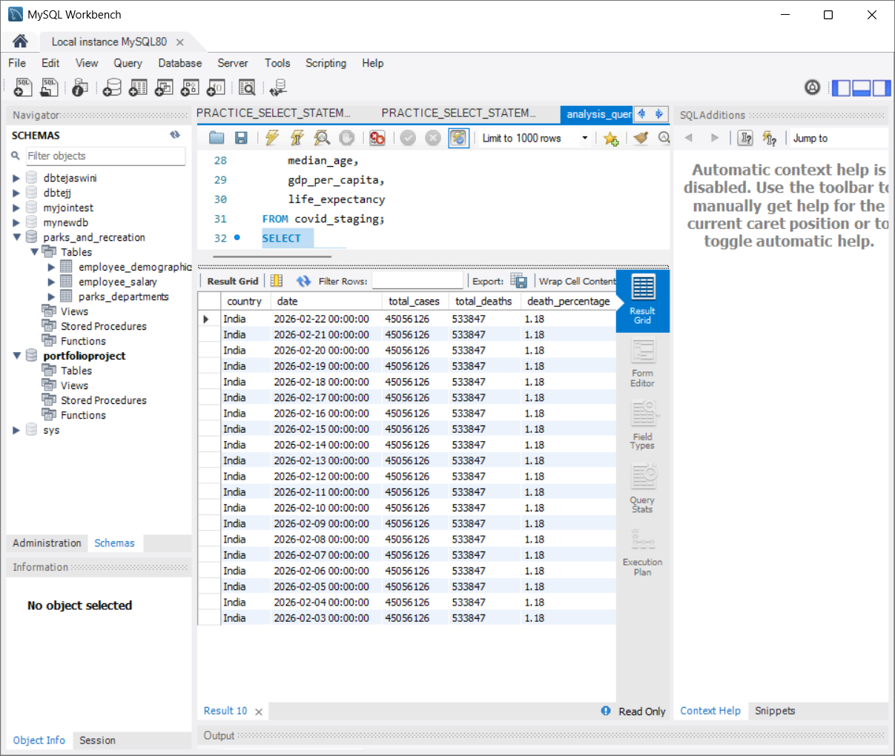
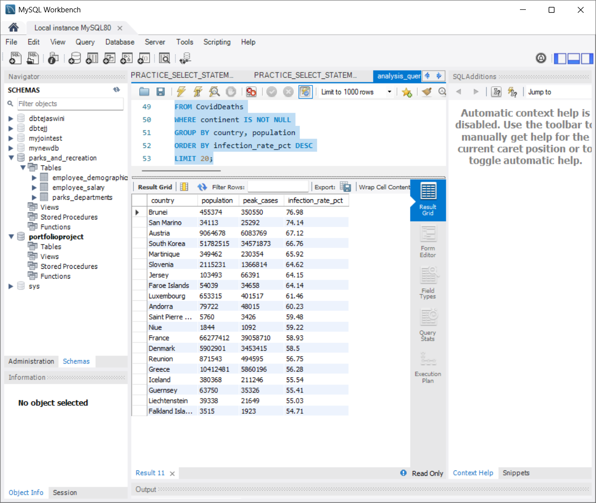
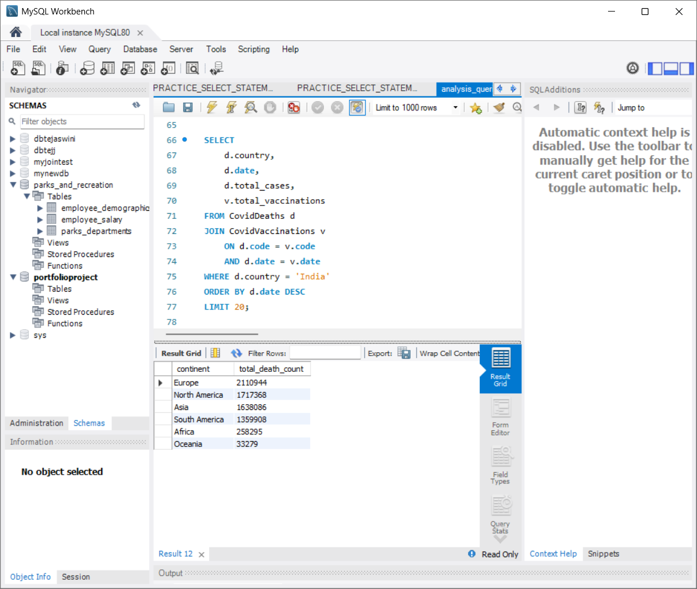
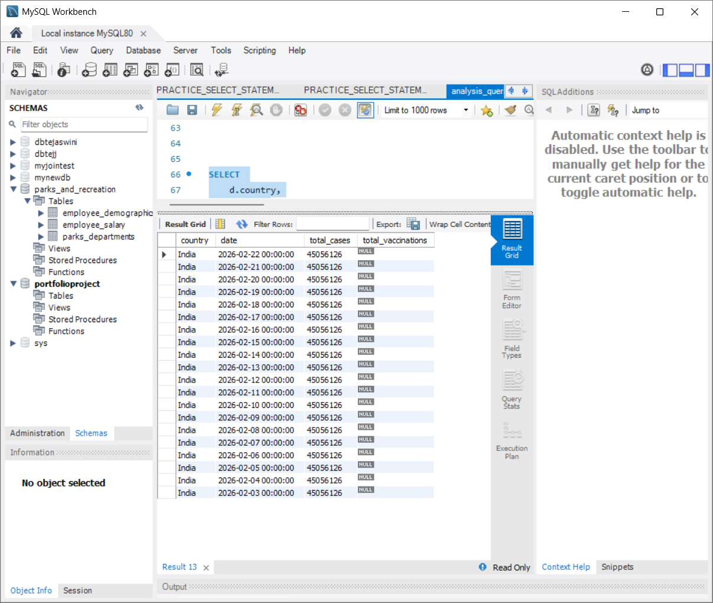

# COVID Data Engineering Project

## 📖 Overview
This project demonstrates an end-to-end data engineering workflow using real-world COVID-19 data.

## 🚀 Tech Stack
- Python (pandas)
- MySQL
- SQL
- Jupyter Notebook

## 📊 Dataset
Source: Our World in Data  
https://catalog.ourworldindata.org/garden/covid/latest/compact/compact.csv

## 🔧 Workflow
1. Extracted data using Python
2. Cleaned and transformed dataset
3. Loaded into MySQL database
4. Created structured tables (CovidDeaths, CovidVaccinations)
5. Performed SQL analysis

---

## 📌 Key SQL Analysis

### 1️⃣ Death Percentage (India)

---

### 2️⃣ Infection Rate

---

### 3️⃣ Continent Deaths

---

### 4️⃣ Join Analysis

---

### 5️⃣ Rolling Vaccinations

---

## 🧠 Learnings
- ETL pipeline (Extract → Transform → Load)
- SQL joins and aggregations
- Window functions
- Handling NULL values

---

## 🔗 Future Improvements
- Automate using GitHub Actions
- Deploy on Azure/AWS
